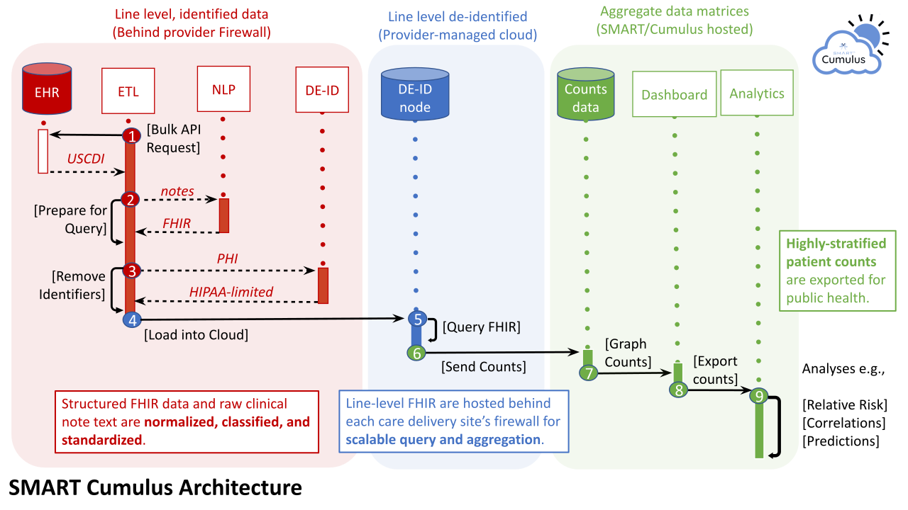
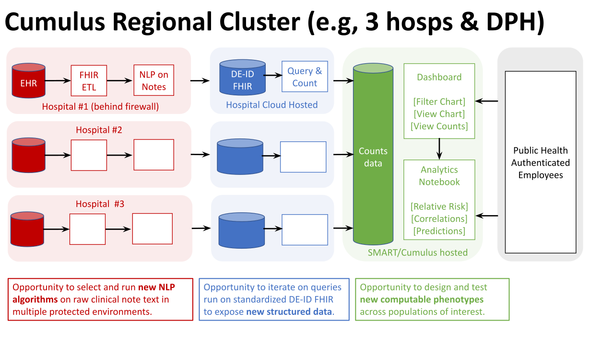

.. contents:: cumulus-etl

Cumulus: Clinical Investigation at Population Scale
====================================================
Cumulus will complement, not replace, the many public health Electronic Lab Reporting (ELR) efforts across cities and states in the USA. Whereas existing ELR interfaces from labs and hospitals provide patient level data on a narrower set of mandated reportable conditions, Cumulus will enable the flow of aggregate and de-identified data on a broader set of health conditions and patient population trends over time.
Cumulus is based out of Boston Children’s Hospital with collaborations in US hospitals and departments of public health.

* `SMART push button population health <https://www.nature.com/articles/s41746-020-00358-4>`_
* `AEGIS infectious disease monitoring <https://pubmed.ncbi.nlm.nih.gov/17600100>`_

21st Century Cures Act: effective Jan 1, 2023
==============================================
Cumulus will capitalize on “21st Century Cures Act” availability of EHR data in bulk FHIR to enable population health investigations locally, regionally, and nationally.
21st century federal regulations take effect beginning Jan 2023, and Cumulus will capitalize on this new clinical datasource for clinical investigations.

Extract EHR data
================
| Extract EHR (Electronic Health Record) using the `SMART bulk data client <https://github.com/smart-on-fhir/bulk-data-client>`_.
| Support for FHIR data model using `SMART FHIR Client <https://docs.smarthealthit.org/client-py/>`_
| For other file formats, see the "**i2b2**" folder for an example.

NLP Physician Notes
============================
* Support physician notes as `FHIR DocumentReference <https://www.hl7.org/fhir/documentreference-definitions.html#DocumentReference.content.attachment>`_
* Support `Unified Medical Language System <https://www.nlm.nih.gov/research/umls/index.html>`_ concept extraction.
* Use the provided `cTAKES client <https://github.com/Machine-Learning-for-Medical-Language/ctakes-client-py>`_ to query `cTAKES COVID container <https://github.com/Machine-Learning-for-Medical-Language/ctakes-covid-container>`_ and `clinical NLP Transformers <https://github.com/Machine-Learning-for-Medical-Language/cnlp_transformers#negation-api>`_

DEID: Patient Privacy
=====================
| Support `De-identification of PHI <https://www.hhs.gov/hipaa/for-professionals/privacy/special-topics/de-identification/index.html>`_  (protected health information)
* PHI stays behind the hospital firewall.
* Physician Notes are NOT shared outside hospital.
* Encrypted patient data at rest and in transit.
* DEID `Codebook.py <./cumulus/deid/codebook.py>`_ replaces real patient identifiers with fake ones (`UUID <https://docs.python.org/3/library/uuid.html>`_)
* Anonymize `structured data anonymization <https://github.com/microsoft/Tools-for-Health-Data-Anonymization>`_
* Count "number of patients" -- this is what is shown in users in Cumulus Dashboard.
* Non-human subjects and minimal disclosures -- non admin users only see numbers of patients or graphs.

Load FHIR data for analysis
===========================
* Support NDJSON bulk FHIR upload to S3 cloud storage (TODO: refactor code)
* Athena SQL queries S3 bucket data (de-identified)

SQL query patient populations
===============================================
| Use provided `Cumulus Library <https://github.com/comorbidity/library>`_ (TODO: reorganize sources)
* Package "public health data feeds" into well defined patient cohort
* Simplifies FHIR data as SQL views for easier accessibility to biomedical staff.
* Simplify common views like Patient demographics, Hospital Encounters, Condition coding, etc.

Dashboard: visualize patient populations
=========================================================
* TODO: Cumulus dashboard github repo link

Regional Cluster
==========================
* `Federalist principles for healthcare data networks <https://www.nature.com/articles/nbt.3180>`_

Single hospital View

Regional Cluster View

Pipeline Sequence
===============================================
There are several phases to the Cumulus pipeline:

#. Download & normalize input

   * For example, converting i2b2 exports sitting in an S3 bucket into local FHIR ndjson files

#. De-identify input
#. Analyze physician notes with NLP
#. Write de-identified & analyzed results to the output folder
